```markdown
# 🛒 E-commerce No Shoppu

**E-commerce No Shoppu** is a Flutter-based e-commerce app with user authentication, product browsing, cart management, and checkout features.

> ⚠️ **Note:** Some demo data stored in Firebase was lost due to passing the free trial limits.

---

## 🌟 Features

*   **User Authentication:** Sign up, log in, and Google Sign-In.
*   **Product Browsing:** Browse by categories, brands, and search functionality.
*   **Shopping Cart:** Add/remove items and manage quantities.
*   **Checkout Process:** Complete orders with address management.
*   **Order History:** View past orders and their status.
*   **User Profile:** Manage account details, addresses, and settings.
*   **Responsive UI:** Smooth animations and a modern, clean design.
*   **Firebase Backend:** Utilizes Firestore, Auth, and Storage.

---

## 💻 Tech Stack

*   **Framework:** Flutter (Dart)
*   **State Management:** GetX
*   **Backend:** Firebase (Auth, Firestore, Storage)
*   **UI & Animations:** Carousel Slider, Lottie, Shimmer
*   **Networking:** HTTP, URL Launcher
*   **Image Handling:** Cached Network Image
*   **Local Storage:** Get Storage

---

## ⚙️ Installation & Setup

1.  **Clone the repository:**
    ```bash
    git clone https://github.com/your_username/ecommerce_no_shoppu.git
    cd ecommerce_no_shoppu
    ```

2.  **Install dependencies:**
    ```bash
    flutter pub get
    ```

3.  **Run the app:**
    ```bash
    flutter run
    ```

*   Ensure you have Flutter installed and an emulator or physical device connected.
*   You may need to configure your own Firebase project and add the configuration files (`google-services.json` & `GoogleService-Info.plist`) for the app to function fully.

---

## 🗂 Project Structure (Feature-First)

```
lib/
├── bindings/               # Dependency injections (GetX)
├── common/                 # Shared widgets & styles
│   ├── styles/
│   └── widgets/
├── data/                   # Data layer
│   ├── dummy_data/
│   ├── repositories/
│   └── services/
├── features/               # Feature modules
│   ├── authentication/     # Login & Sign-up
│   │   ├── controllers/
│   │   ├── models/
│   │   └── screens/
│   ├── shop/               # Product browsing
│   │   ├── controllers/
│   │   ├── models/
│   │   └── screens/
│   ├── cart/               # Cart management
│   │   ├── controllers/
│   │   ├── models/
│   │   └── screens/
│   ├── checkout/           # Order checkout
│   │   ├── controllers/
│   │   ├── models/
│   │   └── screens/
│   ├── orders/             # Order history
│   │   ├── controllers/
│   │   ├── models/
│   │   └── screens/
│   └── profile/            # User profile & settings
│       ├── controllers/
│       ├── models/
│       └── screens/
├── routes/                 # App navigation
└── utils/                  # Utilities & constants
    ├── constants/
    ├── helpers/
    └── validators/
```

---

## 📸 App Walkthrough (Screenshots)

### 1. Authentication
| Sign In | Sign Up | Google Sign-In |
| :---: | :---: | :---: |
| 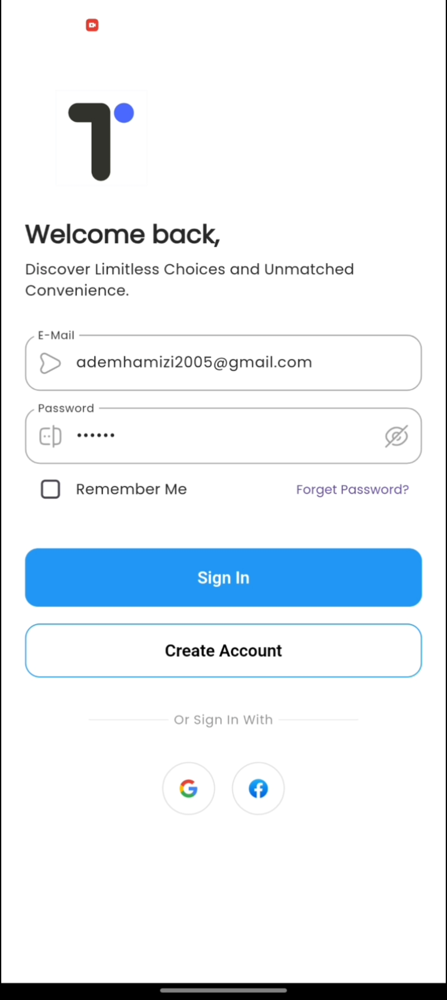 | 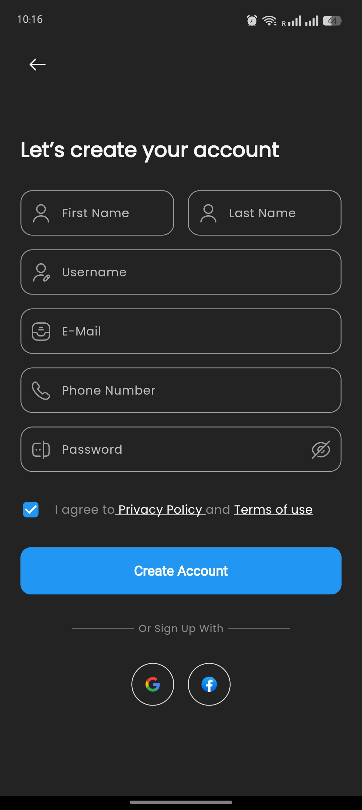 | 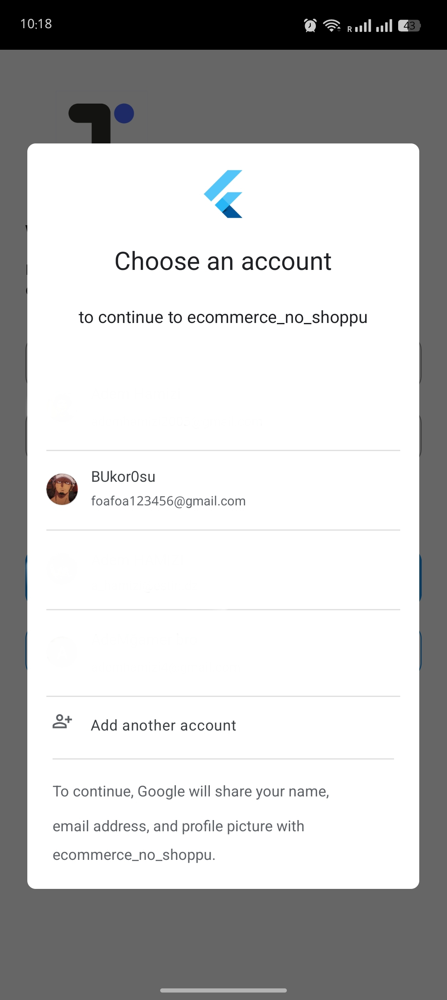 |
| *User Login Screen* | *User Registration Screen* | *Google Sign-In Flow* |

### 2. Home & Shopping
| Home Page | Home Page 2 | Shop Page |
| :---: | :---: | :---: |
| 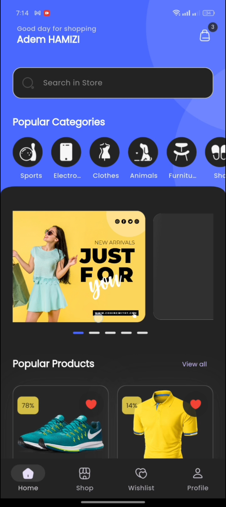 | 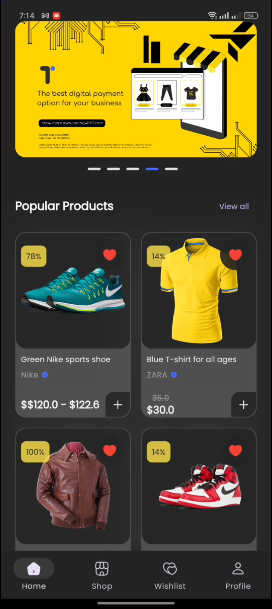 | 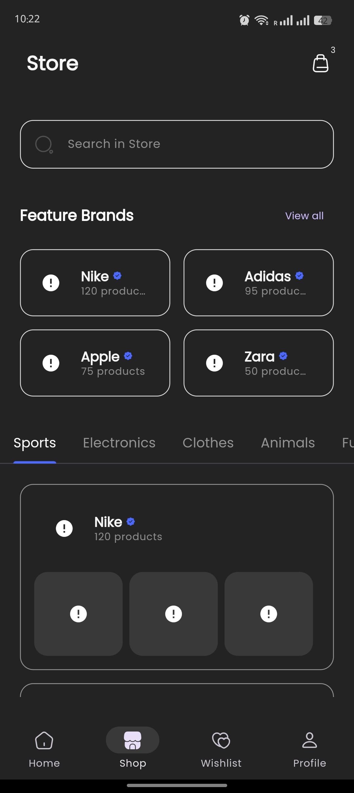 |
| *Main Home Screen* | *Alternate Home View* | *Product Listing Page* |

| Shop Page 2 | Loading State | All Brands |
| :---: | :---: | :---: |
| 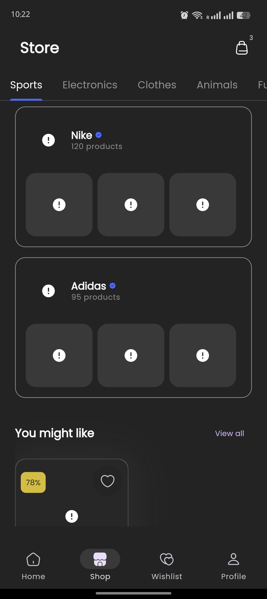 | 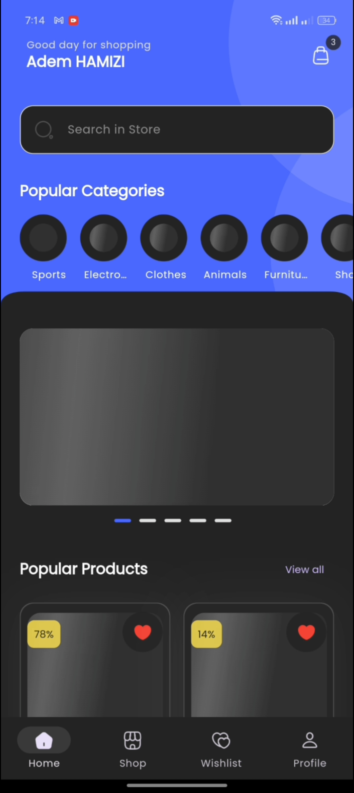 | 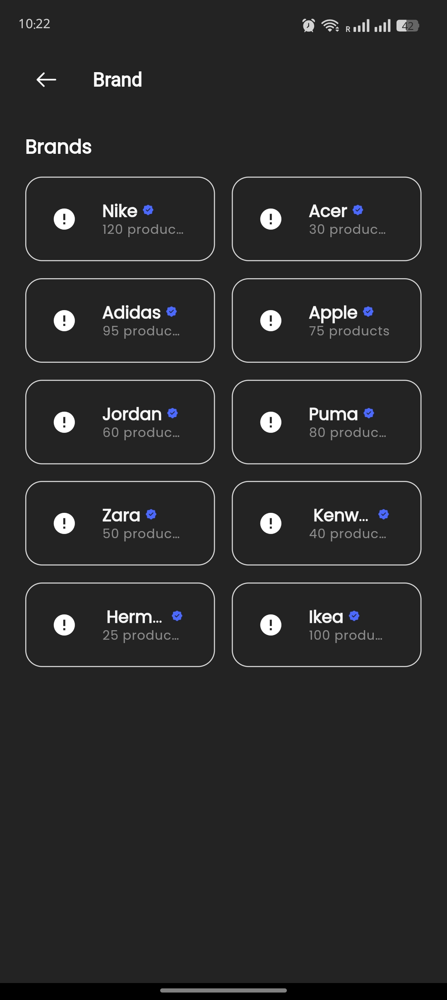 |
| *Filtered Shop View* | *Data Loading Shimmer* | *Browse Brands* |

### 3. Product & Checkout
| Product Details | Product Variants | Checkout |
| :---: | :---: | :---: |
| 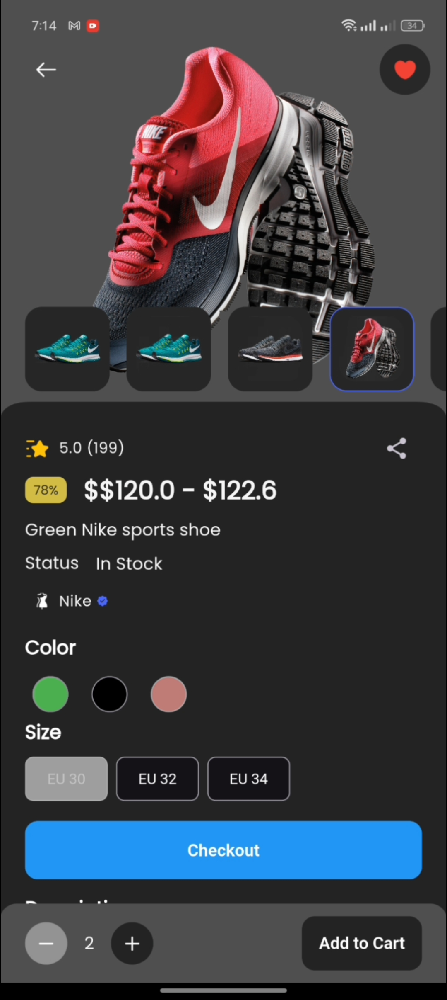 | 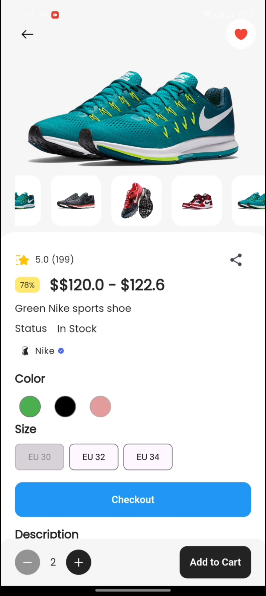 | 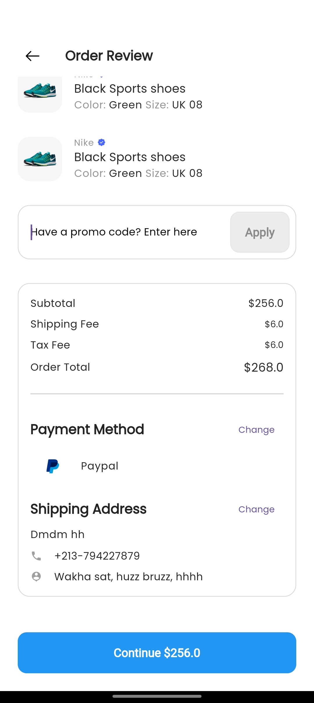 |
| *Individual Product Screen* | *Selecting Product Options* | *Checkout Process* |

### 4. Orders & Profile
| Orders History | Address Management | Profile |
| :---: | :---: | :---: |
| 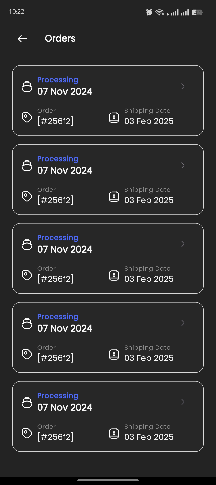 | 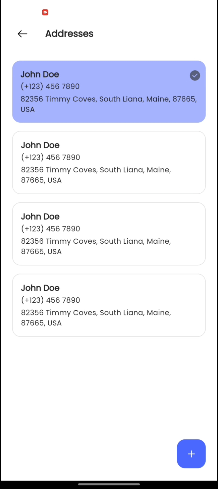 | 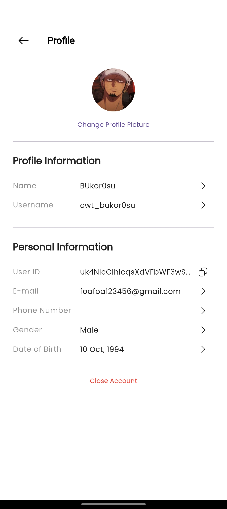 |
| *Past Orders List* | *Saved Addresses* | *User Profile* |

### 5. Account Management
| App Settings | Log Out | Delete Account |
| :---: | :---: | :---: |
| 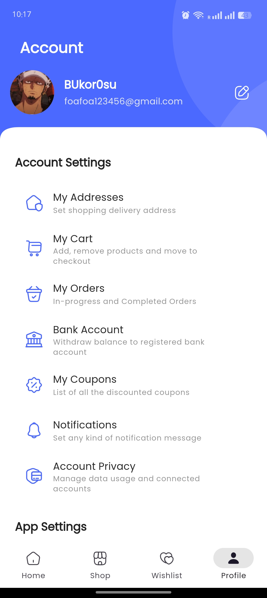 | 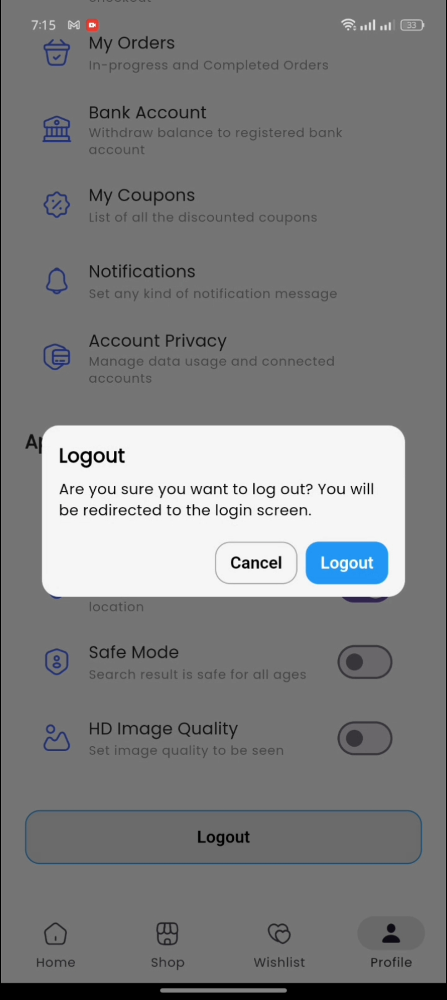 | 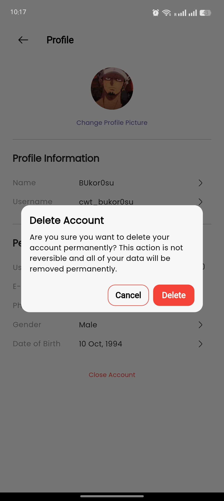 |
| *Application Settings* | *Account Logout* | *Account Deletion* |

| Account Deleted |
| :---: |
| 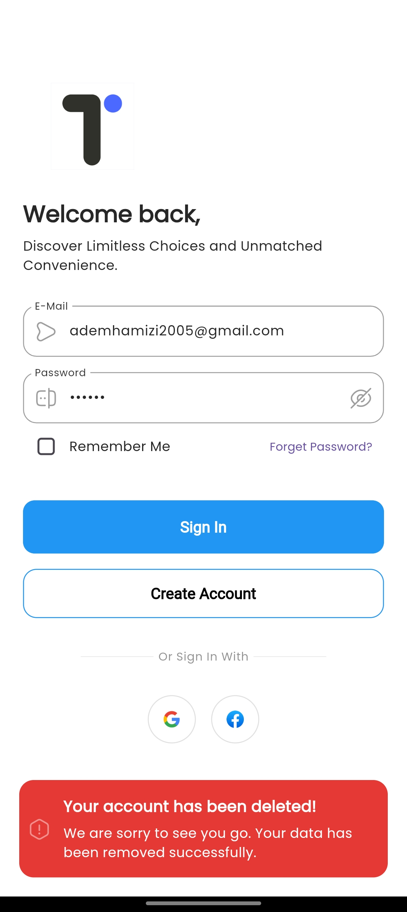 |
| *Deletion Confirmation* |

---

## 👨‍💻 Author

**Adem Hamizi**
- Email: adem.hamizi@lau.edu
- Phone: +213 796550612
- GitHub: [itadoridesu](https://github.com/itadoridesu)
```